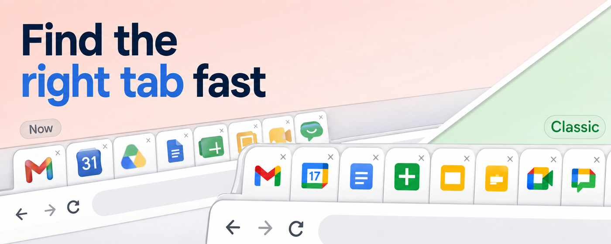

# Classic Tab Icons for Google Workspace™

[](https://github.com/adamallcock/classic-workspace-tabs/actions/workflows/ci.yml)
[](LICENSE)
[](https://developer.chrome.com/docs/extensions/develop/migrate/what-is-mv3)
[](manifest.json)
[](https://chromewebstore.google.com/detail/bpminegnelljndeeolpelmhmdnajojej?utm_source=github&utm_medium=referral&utm_campaign=pre2026-icons)

A tiny Chrome extension that restores familiar pre-2026 tab icons for supported Google Workspace apps.



https://github.com/user-attachments/assets/64889ac5-0129-4bd9-8d5c-a9b34a0374a6

[Chrome Web Store listing](https://chromewebstore.google.com/detail/bpminegnelljndeeolpelmhmdnajojej?utm_source=github&utm_medium=referral&utm_campaign=pre2026-icons)

[Project website](https://adamallcock.github.io/classic-workspace-tabs/)

It is intentionally narrow:

- no popup
- no settings
- no analytics
- no server
- no remote code
- no account system
- no broad host permissions
- no page-body inspection
- no arbitrary website rules

The content script runs only on explicit Google Workspace URLs and only replaces favicon `<link>` elements in `document.head`. The Calendar favicon displays the current local day and refreshes after midnight.

## Supported Apps

- Gmail
- Google Calendar
- Google Drive
- Google Docs
- Google Sheets
- Google Slides
- Google Forms
- Google Meet
- Google Chat
- Google Keep
- Google Contacts
- Google Tasks
- Google Voice
- Google Admin

## Privacy

Classic Tab Icons for Google Workspace™ does not collect, store, transmit, sell, or analyze any user data. It has no server, no analytics, no tracking, no remote code, and no account system. The extension only replaces the tab favicon on supported Google Workspace pages using icon files bundled inside the extension.

## Languages

Chrome metadata is localized in:

- English
- Spanish
- German

The Chrome Web Store detailed descriptions and project landing page use the same three languages.

See [PRIVACY.md](PRIVACY.md).

## Icon Assets

This repository ships bundled classic Google Workspace-style product favicons with confirmed rights for this project, so the extension is ready to load locally or package for distribution. You can also put replacement SVG files in a gitignored `private-icons/` folder and run `npm run package:private`. That overlays the replacement icons into `dist/classic-workspace-tabs-<version>/` without changing tracked source files.

See [ASSETS.md](ASSETS.md).

## Requirements

- Node.js 22 for local development and CI parity.
- Chrome or Chromium for local extension loading and optional smoke testing.
- `openssl` for `npm run smoke:chrome`.

## Local Install

1. Run `npm install`.
2. Run `npm run validate`.
3. Run `npm test`.
4. Open `chrome://extensions` in Chrome.
5. Enable Developer Mode.
6. Click "Load unpacked."
7. Select this project folder.

## Development

```bash
npm install
npm run validate
npm test
npm run package
```

`npm run package` creates a local release zip under `dist/`. The `dist/` folder is ignored and should not be committed.

The Calendar date icons are generated from the bundled Calendar SVG:

```bash
npm run generate:calendar-icons
```

For release-oriented local verification, also run:

```bash
npm run smoke:chrome
```

For the release checklist, see [docs/runbooks/2026-07-02-release-checklist.md](docs/runbooks/2026-07-02-release-checklist.md).

For a package with replacement icon files:

```bash
mkdir -p private-icons
# Add gmail.svg, calendar.svg, drive.svg, docs.svg, sheets.svg, slides.svg,
# forms.svg, meet.svg, chat.svg, keep.svg, contacts.svg, tasks.svg,
# voice.svg, and admin.svg to private-icons/.
npm run package:private
```

Load the generated `dist/classic-workspace-tabs-<version>/` directory as the unpacked extension.

## Permission Model

`manifest.json` uses:

- `permissions: []`
- no `host_permissions`
- no background service worker
- no popup or options page
- explicit content script matches only

## Trademark

This project is not affiliated with, endorsed by, or sponsored by Google. Google Workspace product names and logos are trademarks of Google LLC.
